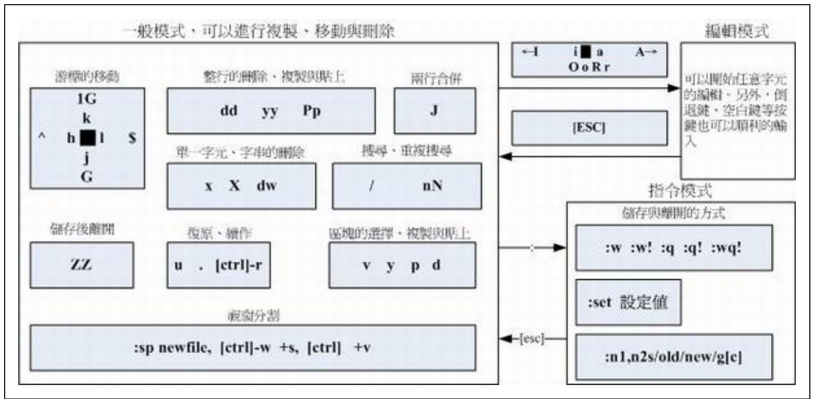

<!-- omit in toc -->

# Introduction

<br />

<!-- omit in toc -->

# Table of Contents

<br />

# Fundamental Concepts

## 1. Mode
* command mode
* insert mode
  * Type any `i, I, o, O, a, A, r, R` in **command mode** to enter insert mode
  * Type `Esc` to exit insert mode
  * if your permission is only read, you can use `:wq!` to write files when your still can be changeable
* command-line mode
  * Type any `: / ?` in **command mode** to enter command-line mode
  * Type `Esc` to exit command-line mode

<br />

## 2. Records of Vim
* automatically generate ~/.viminfo to record command history
* see all environment configures `:set all`
  * `:set nu` see **3. Command Line Mode**
* permanently set specific configures
  * `/etc/vimrc` stores all configurations
    > not recommended to revise the file
  * create `~/.vimrc` to store specific configures
    ```s
    vim !/.vimrc

    # insert mode: with colons or no colons both are same
    set hlsearch
    set backspace=2 
    ...
    
    ```

<br />

## Vim cheat sheet


## Chinese in files
* garbles in files => encoding issue
  * **big5** commonly used in chinese files
  * vim may use **utf8**
* set linux language
  * linux languages configuration is stored in `/etc/locale.conf`
  ```s
  LANG=zh_TW.big5
  export LC_ALL=zh_TW.big5
  
  # go to terminal tool to choose big5
  ```

## copy text files in different systems 
* use `unix2dos` or `dos2unix` to avoid the issue of line ending in Linux and DOS (windows)

## switch encoding
* use `iconv`

# Commands 

## 1. Command Mode
|Meaning|Command|
|:---|:---:|
|Up|↑ or `k`|
|Down|↓ or `j`|
|Left|← or `h`|
|Right|→ or `l`|
|Go to the last line of the file|`G`|
|Go to the first line of the file|`gg`|
|Go to the first character of the line|`0` or `home`|
|Go to the last character of the line|`$` or `end`|
|move right n characters|n`space`|
|move downward n lines|n`enter`|
|find keywords|/word|
|search for keywords in next lines|`n`|
|search for keywords in previous lines|`N`|
|delete previous character or later character|`x`; `X`|
|replace word1 to word2 from the first line to the bottom line and print a confirmation|`:1,$s/word1/word2/gc`|
|delete the whole line|`dd`|
|copy the whole line|`yy`|
|paste the line to the front or the back of the current line|`p`;`P`|
|undo|`u`|
|refresh the page|`ctrl+r`|
|copy the last action|`.`|
|copy the block|`ctrl+v` in windows, the command of copy needs to be modified|


## 2. Insert Mode
|Switch to Insert mode|`i`|
|Insert text at the beginning of the current line|`I`|
|Append after the cursor's current position|`a`|
|Append to the end of the line|`A`|
|Open a new line under the current line|`o`|
|Open a new line above the current line|`O`|
|Replace a character at once|`r`|
|Replace characters until `ESC`|`R`|

## 3. Command Line Mode
|write|`:w`|
|force the file to be written|`:w!`|
|exit|`:q`|
|force to leave files without saving data|`:q!`|
|exit and write|`:wq` or `:wq`|
|leave and save files if files have been modified|`ZZ`|
|save to other file|`:w [filename]`|
|read other file|`:r [filename]`|
|save contents from n1 to n2 to other file|`:n1,n2 w [filename]`|
|leave file and use command|`:! [command]`|
|display the number of line|`:set nu`|
|not displace the number of line|`:set nonu`|


## 4. Recover files
* **recover** first and then **delete** (enable to delete .swap) 

```s
  # see filename extension is .conf.swp
  ls -all
```


## 5. Edit Multiple files
```s
  # vim multiple files
  vim <file1> <file2>

  # change to another file
  :n
  :N

  # see all files to be edited
  :files

```

## 6. Split vim windows

```s
  # split the same file
  :sp

  # add other files
  :sp <file>

  # move to another window
  ctrl + w + down

  # exit 
  :q
```

## 7. auto completion
* insert mode
  
```s
  # 1. type a character
  # 2.
  ctrl + x

  # 3. find words in the current file
  ctrl + n

  # 3. find keywords in specific file types e.g. .html or .php
  ctrl + o

  # 3. find file name in the current directory
  ctrl + f

```