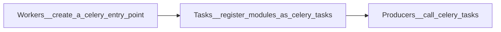

<!-- omit in toc -->
# Importance of Queue

Limited resources emphasize the importance of queues. In the modern technology world, real-time response is a key to keeping users continuously using applications or services. However, not everything has equal importance in real-time response.

Take social software for example. Users care more about submitting something quickly. The latency should not be over half a second. The next person to follow the person's contents can delay 1 to 10 seconds. It is important to know [simultaneity does not matter](https://decafbad.com/blog/2008/07/04/queue-everything-and-delight-everyone/) and latency is acceptable. Moreover, with limited resources, it is hard to operate everything at the same time. And these points highlight why the queue is acceptable and even delightful to take advantage of.

To accomplish queue, Celery system is developed.

 

<!-- omit in toc -->
# Table of Contents
- [Fundamental Concepts](#fundamental-concepts)
  - [Celery](#celery)
  - [Queues](#queues)
  - [Flower](#flower)
- [Commands](#commands)
  - [Install Celery](#install-celery)
  - [**TODO**](#todo)
  - [Celery Flow](#celery-flow)
    - [1. Create an **entry point** of Celery, which is called Celery application/app](#1-create-an-entry-point-of-celery-which-is-called-celery-applicationapp)
      - [include](#include)
    - [2. Register as a Celery **Task**](#2-register-as-a-celery-task)
    - [3. Call **Tasks**](#3-call-tasks)
    - [apply_scync](#apply_scync)
    - [delay](#delay)
    - [signature](#signature)
      - [opposite signature: immutable signature](#opposite-signature-immutable-signature)
  - [Help](#help)
  - [Run Celery Worker](#run-celery-worker)
    - [Parameters](#parameters)
  - [Monitor registered tasks](#monitor-registered-tasks)

# Fundamental Concepts
## Celery

* **Task queue systems**
  1. input: a unit of work, called a task
  2. workers process tasks
  3. monitor the queue 
* Celery communicates by **messages**
* uses a **broker** to mediate (send/receive messages) between clients and workers
  * broker: RabbitMQ, Redis, Amazon SQS ... etc.
* Celery is written in **Python**

## [Queues](https://docs.celeryq.dev/en/stable/userguide/routing.html)
* Automatic routing
  * by default:  task_create_missing_queues
  * a named queue not defined in task_queues will be created automatically

## Flower
  * a web-based tool for monitoring and administrating Celery clusters

# Commands

## Install Celery
        pip install celery

## **TODO** 
    apt install python-celery-common

## Celery Flow

### 1. Create an **entry point** of Celery, which is called Celery application/app
        app = Celery('<current_module_name>', include=[''], broker='<message_broker_URL>')

#### include
* path of modules to import, so Celery workers can find tasks
* relative path depends on where to run celery workers by CLI

### 2. Register as a Celery **Task**
    @app.task
    def function():
        ...

### [3. Call **Tasks**](https://docs.celeryq.dev/en/stable/userguide/calling.html#guide-calling)
### apply_scync
* can set set **additional execution options**

        task.apply_async(queue=<queue_name>, args=[arg1, arg2], kwargs={'kwarg1': 'x', 'kwarg2': 'y'})  

### delay
* a more **convenient** way to call task than apply_scync
        
        task.delay(arg1, arg2, kwarg1='x', kwarg2='y')

### signature
* as the parameters of other functions
* used with chain to create a workflow
* use ".s", means that the result or return value of the front task will be pass to the next one

        res = chain(add.s(2, 2), add.s(4), add.s(8))
        res().get()
        >> 16

#### opposite signature: immutable signature
* every task is independent
* .si = .signature(..., immutable=True)
  
        res = chain(add.si(2, 2)|add.si(4, 4)|add.si(8, 8))()
        res.get()
        >>16
        res.parent.get()
        >>8
        res.parent.parent.get()
        >>4

## Help
        celery --help
        celery worker --help

## Run Celery Worker
* run the worker in the directory above folder with any celery-related scripts
    
        pipenv run celery -A proj worker --loglevel=INFO --concurrency=10 -n worker1@%h

### Parameters
  * start multiple workers on the same machine
    * %h: hostname including domain name => worker1@george.example.com
    * %n: Hostname only => worker1@george
    * %d: Domain name only => worker1@example.com

## [Monitor registered tasks](https://docs.celeryq.dev/en/stable/userguide/monitoring.html)

        celery inspect registered

    
