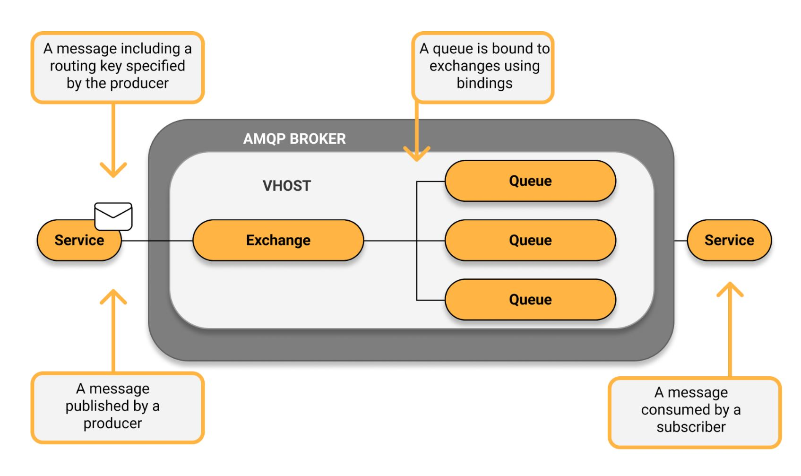
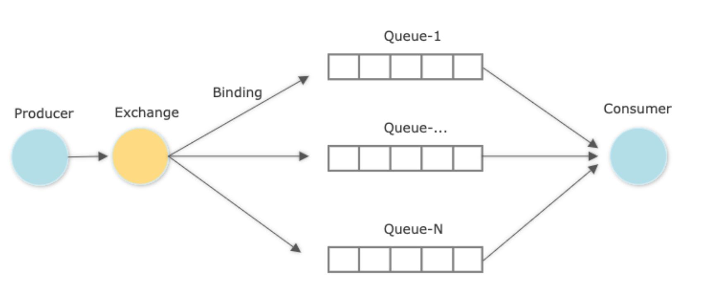

<!-- omit in toc -->
# Introduction
Take notes of RabbitMQ

 

<!-- omit in toc -->
# Table of Contents
- [Fundamental Concepts](#fundamental-concepts)
  - [AMQP (Advanced Message Queuing Protocol)](#amqp-advanced-message-queuing-protocol)
  - [Virtual Host](#virtual-host)
- [RabbitMQ](#rabbitmq)
  - [5 entities](#5-entities)
    - [Producer](#producer)
    - [Consumer](#consumer)
    - [Queue](#queue)
    - [Exchange](#exchange)
    - [Binding](#binding)
  - [port](#port)

 

# Fundamental Concepts
## [AMQP (Advanced Message Queuing Protocol)](https://www.cloudamqp.com/blog/what-is-amqp-and-why-is-it-used-in-rabbitmq.html)
* allow messaging interoperability between systems no matter what platforms or message broker vendor are used
* It defines a set of messages capabilities which must be followed by the **broker**
* an application layer protocol that focuses on process-to-process communication **across IP networks**
* everything sent over AMQP is **binary data**

 

## Virtual Host
* a [namespace](https://www.rabbitmq.com/uri-spec.html) for objects like Exchanges, Queues and Bindings
* [Vhosts](https://stackoverflow.com/a/66587594) are to Rabbit; virtual machines are to physical servers
* allow to run data for **multiple applications** safely and securely by providing **logical separation** between instances
* to avoiding **naming collisions** on queues and exchanges when running multiple Rabbits
* Each vhost is essentially a **mini-RabbitMQ server** with its own queues, exchanges, and bindings ... etc, more important, with its own **permissions**.
 

 

# RabbitMQ
* a messaging system that uses AMQP as the basis for a set of standards controlling the entire message passing process
* message brokers:
    * like a post office, send messages to message receivers
* [docker-compose for RabbitMQ](https://hub.docker.com/_/rabbitmq)

## 5 entities
### Producer
  * send messages to queues
  * if there is Exchange, producers will send messages to Exchange
### Consumer
  * receive messages
### Queue
  * store messages
  * First In First out
  * each queue with its own ID
### Exchange
  * send messages to queues based on conditions
  * conditions:
      * direct: send to specific queues
      * topic: send to queues based on binding rules, like regular expression
      * headers: send to queues based on headers of data
      * fanout: send to all queues
### Binding
  * a relationship between an exchange and a queue

 

## [port](https://stackoverflow.com/questions/12792856/what-ports-does-rabbitmq-use)
  * 15672: 
      * Management console for version 3.x
      * HTTP API clients and rabbitmqadmin (only if the management plugin is enabled)
  * 5672:
      * default
      * RabbitMQ main port
