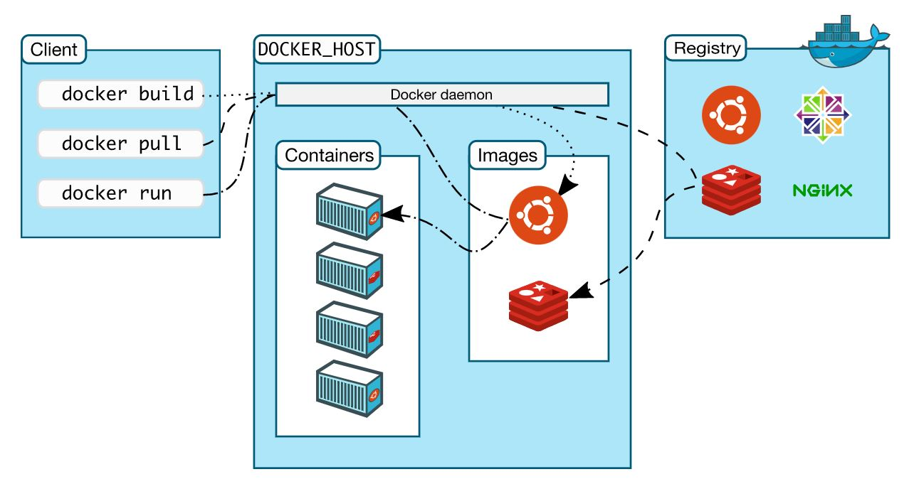
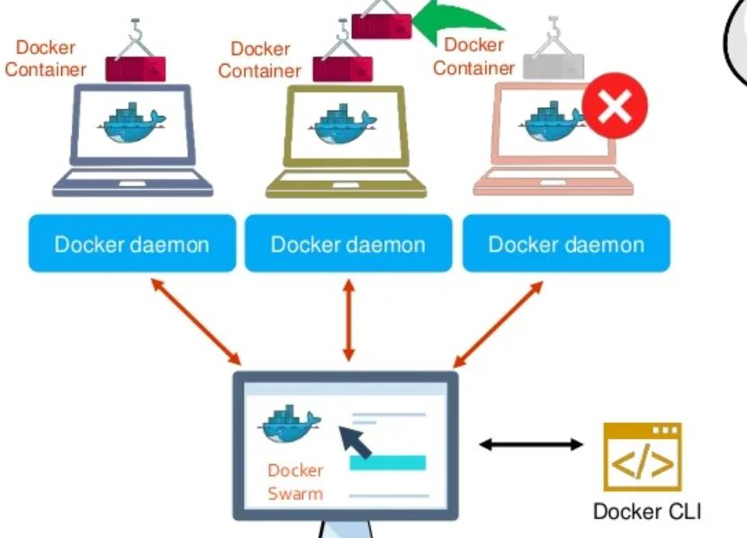
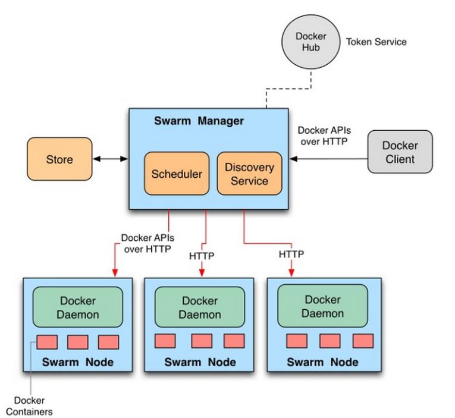

<!-- omit in toc -->
# Introduction
Take notes of Swarm

<br />

<!-- omit in toc -->
# Table of Contents
- [Fundamental Concepts](#fundamental-concepts)
  - [Docker Architecture](#docker-architecture)
    - [Docker Daemon](#docker-daemon)
    - [Docker Client](#docker-client)
    - [Docker Registries](#docker-registries)
  - [Docker Swarm](#docker-swarm)
    - [API](#api)
    - [Services](#services)
  - [Portainer](#portainer)
    - [Stack](#stack)
- [Commands](#commands)
  - [Initialize docker swarm](#initialize-docker-swarm)
  - [Make Other Machines as Workers](#make-other-machines-as-workers)
  - [Activate Portainer](#activate-portainer)
  - [Create Network](#create-network)
  - [Add other Services](#add-other-services)
    - [Deploy Mysql](#deploy-mysql)
      - [Deploy Field](#deploy-field)
  - [Deploy Services](#deploy-services)
- [Issue](#issue)
  - [Mysql Continuously Crashes in Stack](#mysql-continuously-crashes-in-stack)
  - [portainer delete old image serveice automaticall?](#portainer-delete-old-image-serveice-automaticall)
  - [if existing deploy api failed, and test api used api connection](#if-existing-deploy-api-failed-and-test-api-used-api-connection)


<br />

# Fundamental Concepts
## [Docker Architecture](https://docs.docker.com/get-started/overview/#docker-architecture)



> Docker client contacts docker dameon. Docker dameon pulls images from registry and creates a new container with the image. The container executes commands in the image inside the container. Docker dameon streams the output from the command to the Docker client in the terminal. 


### Docker Daemon

* Docker Daemon interacts with the operating system to create or manage containers 
* Listen for Docker API requests and manages Docker objects

### Docker Client
* The primary way the users interact with Docker, e.g. use commands to operate Docker
* Docker client talks to docker daemon to manage containers

### Docker Registries
* To store Docker images
* Example: Docker Hub => a public registry for anyone
* docker pull image => go to Docker Hub and pull required images to build environment

<br />

## Docker Swarm

[Reference](https://www.youtube.com/watch?v=Tm0Q5zr3FL4)



### API
docker nodes/containers communicate Docker Swarm by RESTful API over HTTP

### Services
* a description of tasks or the state
* Modes
  * global: run on every Swarm node
  * replicated: 
    * manager node distribute tasks to worker nodes
    >  replication: the process of sharing information so as to ensure consistency between redundant resources  
  
    
  
<br />


## Portainer
* UI for Swarm

### Stack
* a collection of services that make up an application in a specific environment
* a stack file is in Yaml format
* deploy multiple services linked together
  

<br />

# Commands
## Initialize docker swarm
* Current machine is manager machine
* Creates two random tokens, a worker token and a manager token
> when deploy a docker swarm, at least one node must be deployed

    docker swarm init 

<br />

## Make Other Machines as Workers
* generate worker token for machines to be workers
  
        # in manager machine 
        docker swarm join-token worker 

* Use worker token in machines to be workers

<br />

## Activate Portainer
* [portainer.yml](https://github.com/portainer/portainer-compose/blob/master/docker-stack.yml) 

        docker stack deploy -c portainer.yml por

<br />

## Create Network
> make sure there is no existing network with same name. If there is, remove the existing network first.

    docker network create --scope=swarm --driver=overlay my_network

  * Scope: the scope of network
  * Driver: overlay = services in the swarm can connect to each other
    > Networking mode: overlay

<br />

## Add other Services
### Deploy Mysql 

    version: '3.3'
    services:
    mysql:
        image: mysql:8.0
        command: mysqld --default-authentication-plugin=mysql_native_password
        ports:
          - 3306:3306
        environment:
            MYSQL_DATABASE: stock
            MYSQL_USER: user
            MYSQL_PASSWORD: user
            MYSQL_ROOT_PASSWORD: root
        volumes:
          - mysql:/var/lib/mysql
        deploy:
            mode: replicated
            replicas: 1
            placement:
                constraints: [node.labels.mysql == true]

#### Deploy Field
* mode
* replicas
* placement
* constraints
    * Purpose: to assign services to different nodes if there are multiple nodes 
    * First go to Portainer UI to add labels, so nodes can identify the service assigned to them
      > Portainer UI: Swarm -> Nodes -> click a specific node -> Node Labels -> add the label of the service

<br />

## Deploy Services

    docker stack deploy --with-registry-auth -c <service.yml> <stack_name>

* -c, --compose-file strings   Path to a Compose file, or "-" to read from stdin
*  --with-registry-auth

<br />

# Issue
## [Mysql Continuously Crashes in Stack](https://serverfault.com/a/970821)

    Check that you do not already have another mysqld process using the same InnoDB data or log files

  1. Run ```ls -la``` in your mysql data directory
  2. ```ps -ef | grep mysqld```
  3. ```sudo kill -9 <mysqld_id>```
  4. Run the container again

## portainer delete old image serveice automaticall?

## if existing deploy api failed, and test api used api connection
use different environment for development

develop code in test env (test api), and use cicd for test environment (x),
use make to test all codes in test env.  >> before merging branch

 when all scccuess,merge branch


=> it is important to write a flow of cicd settings, if only production environment